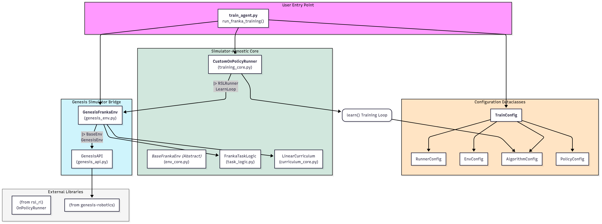

# Simulator-Agnostic Franka RL Training

This project provides a framework for training a Franka Emika Panda robot for trajectory-tracking tasks using reinforcement learning. The agent currently considers joint limit and self collision awareness. The next phase will involve incorporating external collisions.


## Project Structure

```
genesis_fun/
├── genesis_bridge/
│   ├── __init__.py
│   ├── genesis_api.py      # Low-level wrapper for Genesis API calls
│   └── genesis_env.py      # Concrete Franka environment using Genesis
├── sim_agnostic_core/
│   ├── __init__.py
│   ├── curriculum_core.py  # Logic for curriculum learning
│   ├── env_core.py         # Abstract base class for all Franka environments
│   ├── task_logic.py       # Task-specific logic (shelf/target randomization)
│   └── training_core.py    # Core training runner and configs
├── xml/
│   └── franka_emika_panda/
│       └── panda.xml       # Robot MJCF model
├── train_agent.py          # Main entry point for training
├── requirements.txt
└── README.md
```



The codebase is organized into two main packages, which separate the core logic from the simulator-specific implementation:

* `sim_agnostic_core/`: This directory contains all the high-level reinforcement learning logic that is independent of any specific simulator.

    * `training_core.py`: Defines the configuration dataclasses and a custom RSL-RL `OnPolicyRunner` for handling the training loop, logging, and model checkpointing.
    * `env_core.py`: Defines the abstract `BaseFrankaEnv` class, which specifies the required interface that all simulator-specific environments must implement.
    * `curriculum_core.py`: Contains the logic for curriculum learning, allowing for dynamic adjustment of task difficulty and reward parameters based on agent performance.
    * `task_logic.py`: Encapsulates the procedural generation of the task itself, such as randomizing shelf positions and sampling goal locations.

* `genesis_bridge/`: This directory acts as the bridge to the Genesis simulator. It contains all the code that directly interacts with the Genesis API.

    * `genesis_api.py`: A dedicated wrapper class that encapsulates all calls to the `genesis` library, providing a clean interface for scene creation, state querying, and robot control.
    * `genesis_env.py`: The concrete implementation of `BaseFrankaEnv`, which uses the `GenesisAPI` to run the simulation and connects the simulator's state to the RL task.

This modular design allows me to develop and test your RL algorithms independently of the simulation backend.

## Setup and Installation

Follow these steps to set up the project and install the necessary dependencies.

### 1. Prerequisites

* Python 3.8 or later.
* If you have a compatible NVIDIA GPU, ensure that you have the appropriate CUDA drivers installed to leverage GPU acceleration with PyTorch and Genesis.

### 2. Installation

1.  **Clone the repository:**
    ```bash
    git clone git@github.com:moribots/genesis_fun.git
    cd genesis_fun
    ```

2.  **Create a conda environment:** (Recommended)
    ```bash
    conda create -n env_genesis python=3.10
    conda activate env_genesis
    ```

3.  **Install PyTorch:**
    It is recommended to install a version of PyTorch compatible with your CUDA toolkit. Visit the [official PyTorch website](https://pytorch.org/get-started/locally/) for the correct command. For example, for CUDA 12.1:
    ```bash
    pip install torch torchvision torchaudio --index-url [https://download.pytorch.org/whl/cu121](https://download.pytorch.org/whl/cu121)
    ```

4.  **Install project dependencies:**
    The remaining dependencies, including `rsl_rl` and `genesis-robotics`, can be installed from the `requirements.txt` file.
    ```bash
    pip install -r requirements.txt
    ```

## Running the Training

The main entry point for training the agent is the `train_agent.py` script.

### Basic Training Command

To start a training session with the default configuration (torque control, logging to W&B), simply run:

```bash
python train_agent.py
```

### Configuration

The training process is configured using dataclasses defined in `sim_agnostic_core/training_core.py`. You can modify the `TrainConfig` object in `train_agent.py` or directly edit the dataclass defaults to change hyperparameters, environment settings, or runner options.

Key configuration options in `training_core.py` include:

* **Control Mode**: In `EnvConfig`, change `control_mode` from `'torque'` to `'velocity'` to switch the robot's control paradigm. The reward functions and curriculum settings will adjust automatically.
* **Logging**: By default, the `RunnerConfig` is set to log metrics and videos to [Weights & Biases](https://wandb.ai).
    * You will be prompted to log in to your W&B account the first time you run the script.
    * You can customize the W&B project, entity, and run name in the `RunnerConfig` dataclass.
    * To disable W&B logging, set `wandb: bool = False` in `RunnerConfig`.
* **Curriculum**: The various `CurriculumConfig` fields within `EnvConfig` control how reward penalties and success thresholds evolve as the agent's performance improves.

### Checkpoints and Videos

* Training checkpoints (model weights) will be saved periodically to the `./training_logs/` directory, as configured by `save_interval` in `RunnerConfig`.
* Videos of the policy's performance will be logged to W&B at regular intervals, as defined by `video_log_interval` in `RunnerConfig`.
